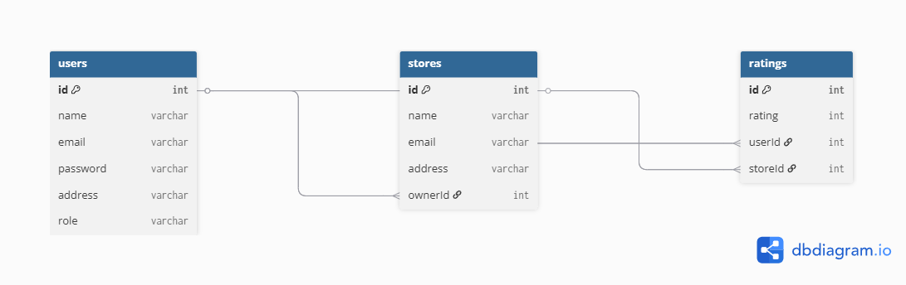

# 🏬 Store Rating App – Full Stack Project

This is a full-stack web application that allows users to submit ratings for stores. It features **role-based access control** for:
- 👤 Normal Users
- 🧑‍💼 Store Owners
- 🛠️ System Administrators

Built using **React + Node.js + PostgreSQL** as part of the internship challenge.

---

## 🚀 Live URLs

- 🔗 **Frontend (Vercel)**: [https://store-rating-app-mauve.vercel.app](https://store-rating-app-mauve.vercel.app)  
- 🔗 **Backend (Render)**: [https://store-rating-app-3rta.onrender.com](https://store-rating-app-3rta.onrender.com)

---

## 🔐 Demo Login Credentials

| Role   | Email                | Password   |
|--------|----------------------|------------|
| Admin  | admin@example.com    | Admin@123   |
| Owner  | owner@example.com    | Owner@123   |
| User   | user@example.com     | User@123    |

> 💡 Use these accounts to test login and access different dashboards.

---

## 🛠️ Tech Stack

- **Frontend**: React, Tailwind CSS, Axios, React Router
- **Backend**: Node.js, Express.js
- **Auth**: JWT, bcryptjs
- **Database**: PostgreSQL (Sequelize ORM)
- **Deployment**: Vercel (frontend), Render (backend & DB)

---

## 📁 Features by Role

### 👨‍💼 Admin
- Login and manage the system
- Add admin, owner, and user accounts
- Add stores and assign owners
- View list of users and stores
- View total stats (user/store/rating count)
- Update password / logout

### 🏪 Store Owner
- Login and view assigned store
- See users who rated their store
- View average store rating
- Update password / logout 

### 👤 Normal User
- Login and browse all stores
- Rate and update rating for any store
- View their submitted ratings
- Update password / logout

---

## 📄 Database Schema



| Table   | Fields |
|---------|--------|
| **Users**   | id, name, email, password, address, role |
| **Stores**  | id, name, email, address, ownerId (FK) |
| **Ratings** | id, rating (1–5), userId (FK), storeId (FK) |

---

## 🔐 Authentication

- JWT-based login
- Passwords securely hashed using bcryptjs
- Role-based protected routes

---

## ⚙️ How to Run Locally

### 1. Clone the Repo

```bash
git clone https://github.com/karangholap154/store-rating-app.git
cd store-rating-app
